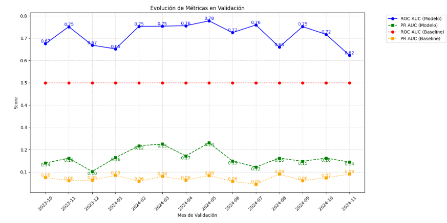
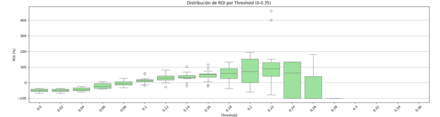

# Customer Churn Prediction

Predicting customer churn for a subscription-based advertisement portal using anonymized historical account and transaction data. The objective is to predict which customers are likely to churn to optimize business decisions (e.g., retention strategies).

## Tech Stack

- Language & Environment: Python 3.11.0, Poetry, pyenv
- Data Manipulation & Analysis: Pandas, NumPy
- Machine Learning: scikit-learn, XGBoost
- Visualization: Matplotlib, Seaborn

## Project Structure

```text
├── data
│   ├── zrive_advertiser_withdrawals.parquet
│   ├── zrive_dim_advertiser.parquet
│   └── zrive_fct_monthly_snapshot_advertiser.parquet
├── docs
│   └── project_report.pdf
├── notebooks
│   ├── eda.ipynb
│   ├── v1_dataset.ipynb
│   ├── v3_feature_engineering.ipynb
│   └── train_boosting.ipynb
├── src
│   ├── feature_engineering.py
│   ├── inference.py
│   ├── prepare_data.py
│   ├── train.py
│   └── utils.py
├── pyproject.toml
├── poetry.lock
├── setup.cfg
└── README.md

```
## Methodology
1. **Exploratory Data Analysis (EDA):** understand data distributions, correlations, and missing values.  
2. **Feature Engineering:** create features like customer tenure, ratios, deltas, rolling averages.  
3. **Model Training:** progressive approach: Logistic Regression → Random Forest → XGBoost. 
4. **Evaluation:** ROC-AUC, Precision-Recall, business metrics.  
5. **Inference:** generate churn predictions on new data.


## Results
- Best model: XGBoost
- ROC-AUC of 0.72 (44% improvement over baseline), and PR-AUC of 0.18
- Business KPI optimization: adjusted threshold of the model to maximize ROI
- Model and insights were presented to the company as part of the course deliverables.


Evolution of evaluation metrics


Estimated ROI according to prediction threshold


## Usage

1. `poetry shell`
2. `poetry install`
3. Create data folder and add files zrive_advertiser_withdrawals.parquet, zrive_dim_advertiser.parquet and zrive_fct_monthly_snapshot_advertiser.parquet
4. `python3 -m src.prepare_data` generates the file processed_data.parquet
5. `python3 -m src.feature_engineering` generates the file full_data.parquet (used for training)

Once full_data.parquet is generated, training notebooks and traind & inference scripts are ready to use. Final training notebook is train_boosting.ipynb.

## Project Report
The full project report is available in `docs/project_report.pdf`.
